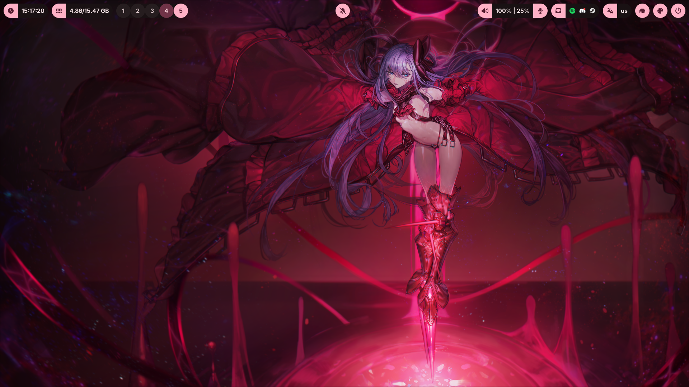
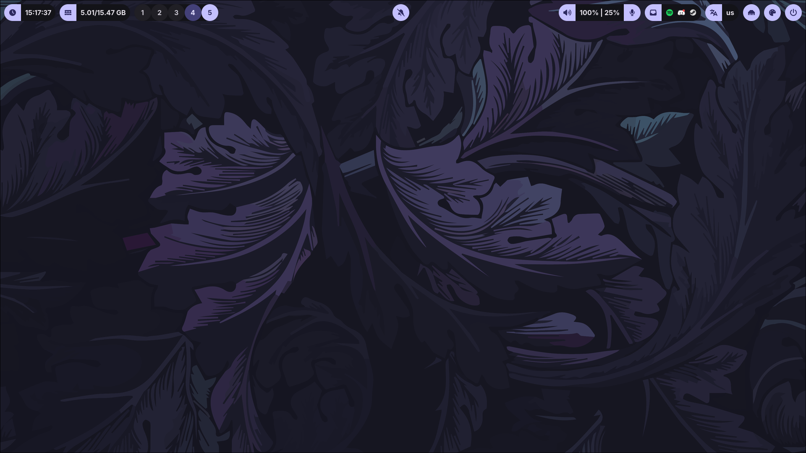
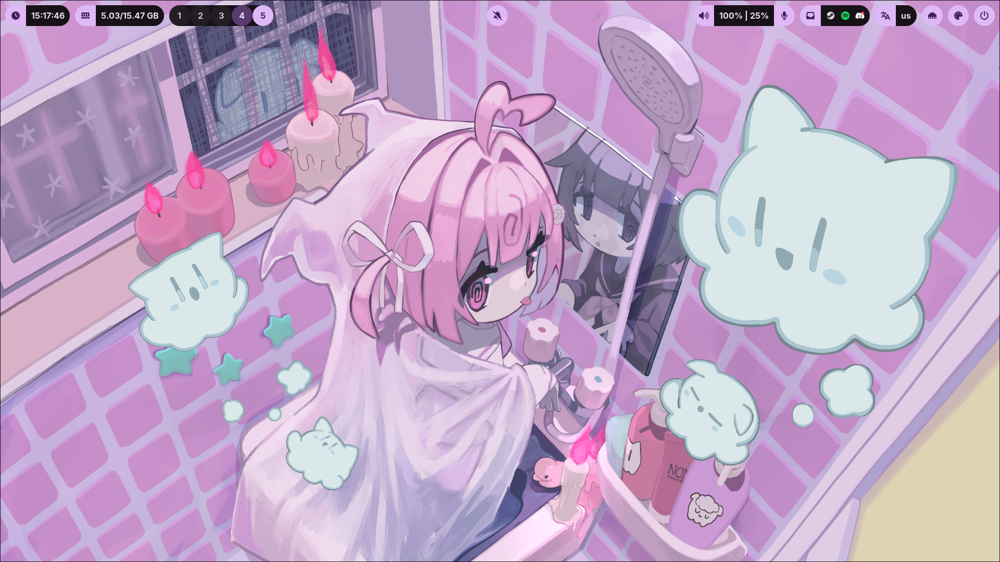
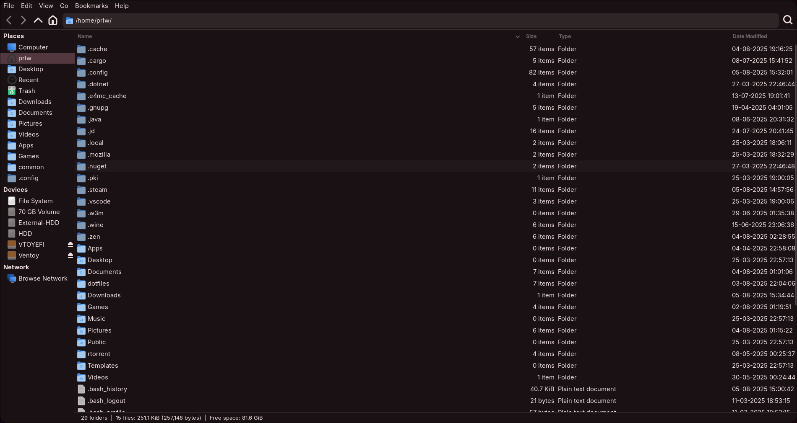
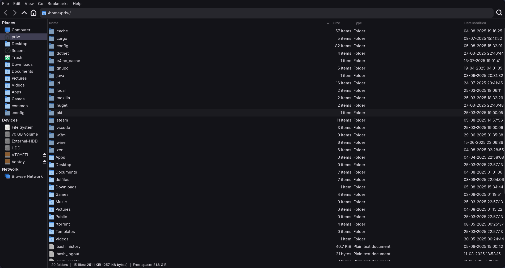
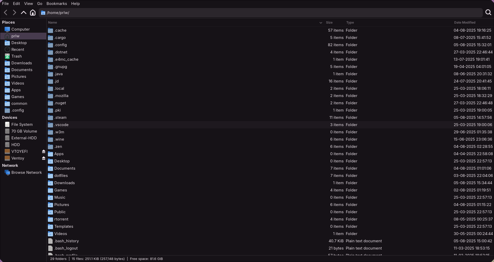
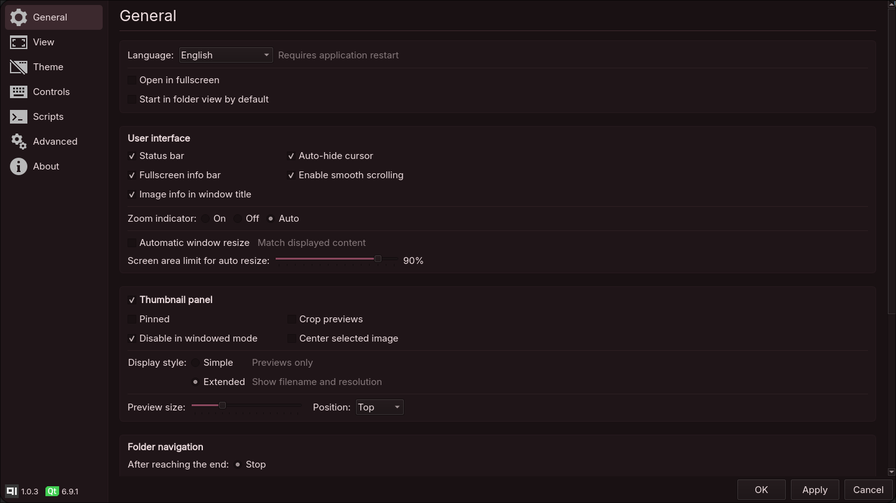
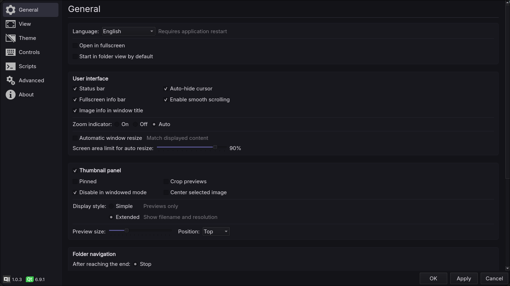
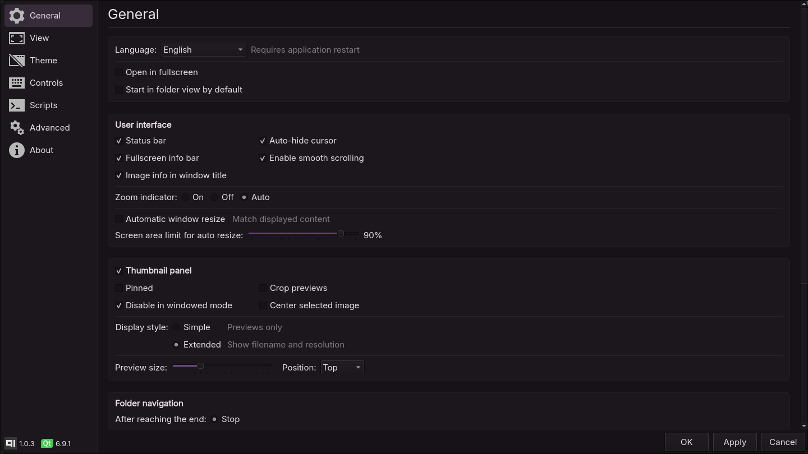

# Dotfiles

Personal NixOS dotfiles for [Hyprland](https://hypr.land/) with **Material You**-inspired dynamic theming using [Matugen](https://github.com/InioX/matugen). It includes configurations the desktop environment, GTK/Qt apps, Rofi, Waybar, and more, all designed to adapt to your wallpaper automatically.


<br>

## 📝 TODO

- [ ] Add links to [📦 Required Packages](#-required-packages) section.
- [ ] Add optional software to [📦 Required Packages](#-required-packages) section.
- [ ] Fix SwayNC styling.
- [ ] Update repository thumbnail.
- [ ] Update [🖼️ Showcase](#️-showcase) photos and videos.

<br>

## 🖼️ Showcase

https://github.com/user-attachments/assets/67947a03-c216-45c9-9c7c-83a172e2590b

https://github.com/user-attachments/assets/7cd3b1b5-f198-4e73-9874-f730d4a72208

> [!NOTE]
> The images below demonstrate how the color palette adapts to different wallpapers. Colors are automatically generated by **Matugen** based on the current wallpaper.

> [!TIP]
> You can add any wallpaper to the **waypaper** menu by moving it to `~/wallpapers/`.

### Desktop

<table>
    <tr>
        <th>Red</th>
        <th>Purple</th>
        <th>Pink</th>
    </tr>
    <tr>
        <td></td>
        <td></td>
        <td></td>
    </tr>
</table>

### GTK (Thunar)

<table>
    <tr>
        <th>Red</th>
        <th>Purple</th>
        <th>Pink</th>
    </tr>
    <tr>
        <td></td>
        <td></td>
        <td></td>
    </tr>
</table>

### QT (Qimgv)

<table>
    <tr>
        <th>Red</th>
        <th>Purple</th>
        <th>Pink</th>
    </tr>
    <tr>
        <td></td>
        <td></td>
        <td></td>
    </tr>
</table>

<br>

## 📦 Required packages

> [!NOTE]
> These packages are required for core functionality. Optional apps (e.g., Firefox, Kitty) are not listed here.

- Adw-GTK3
- Adwaita Icon Theme
- Cliphist
- Font Awesome Icon Library
- Git
- GTK 2
- GTK 3
- GTK 4
- Hyprland
- Hyprlock
- Hyprpicker
- Hyprshot
- Inter Font
- JetBrains Mono Font
- Matugen
- Nerd Fonts
- Qt5ct
- Qt6ct
- Rofi
    - RofiMoji
    - Rofi-Power-Menu
- SwayNC
- swww
- Waybar
- Waypaper
- yadm

<br>

## 📂 Getting the files

> [!CAUTION]
> Backup your current dotfiles before proceeding. This will overwrite existing configuration files.

Clone the repository and overwrite the files with YADM:

```bash
yadm clone "https://github.com/DimitryGonzales/dotfiles.git" && yadm checkout --force
```
