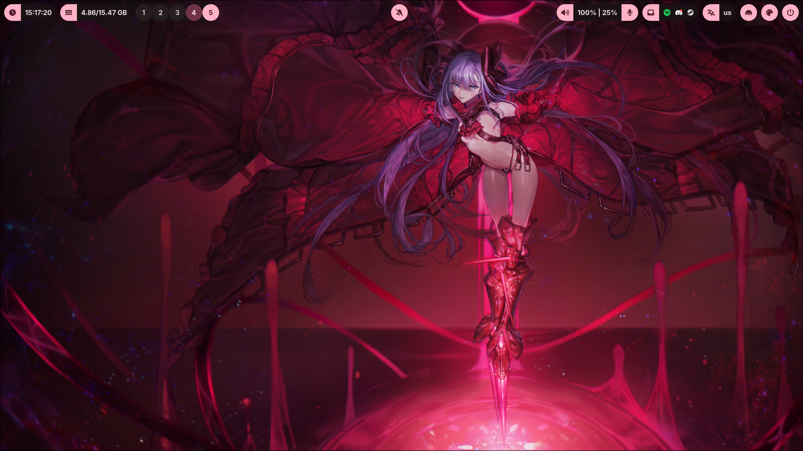
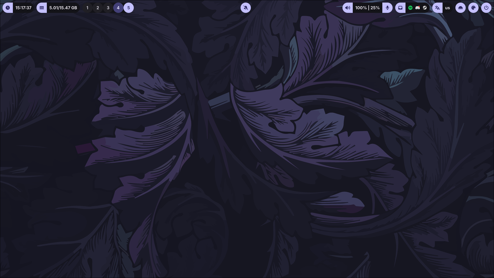
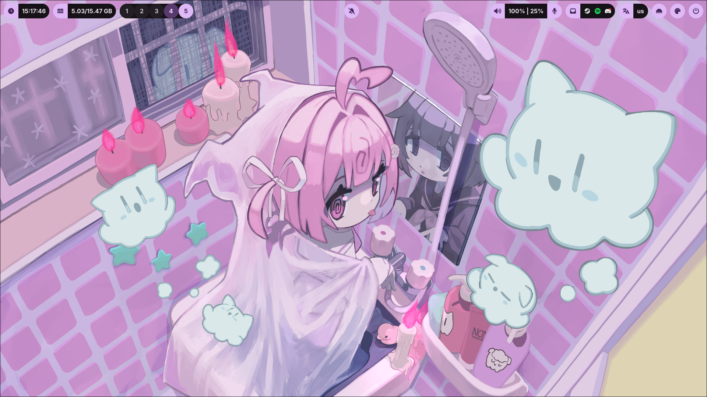
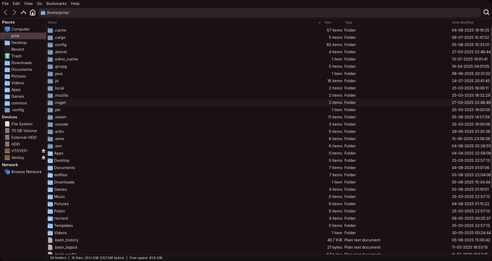
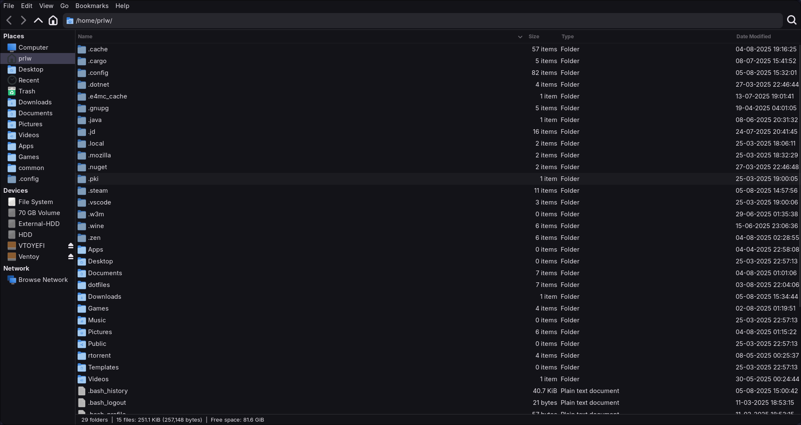
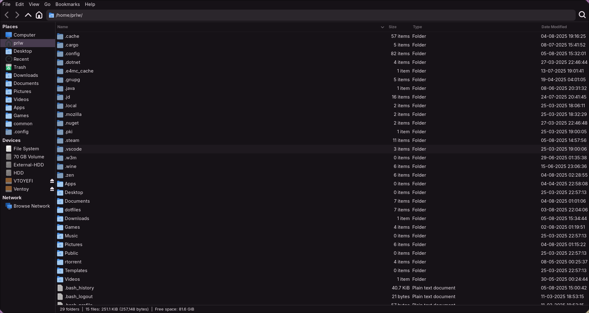
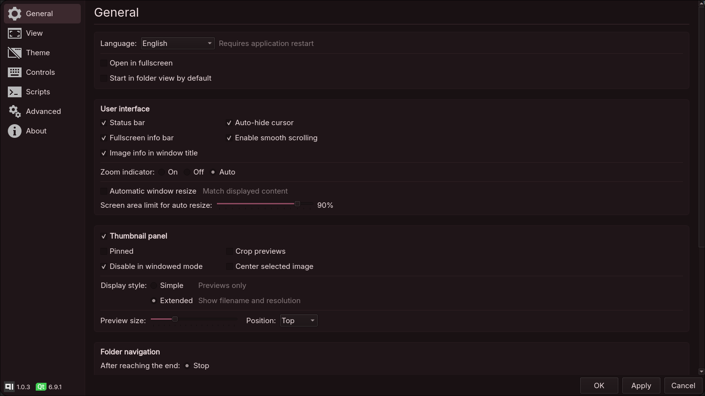
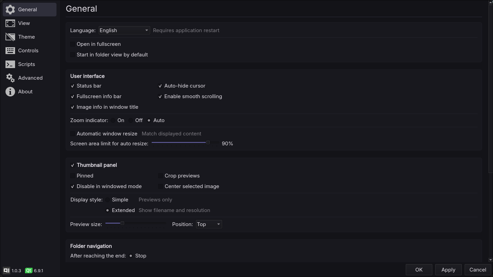
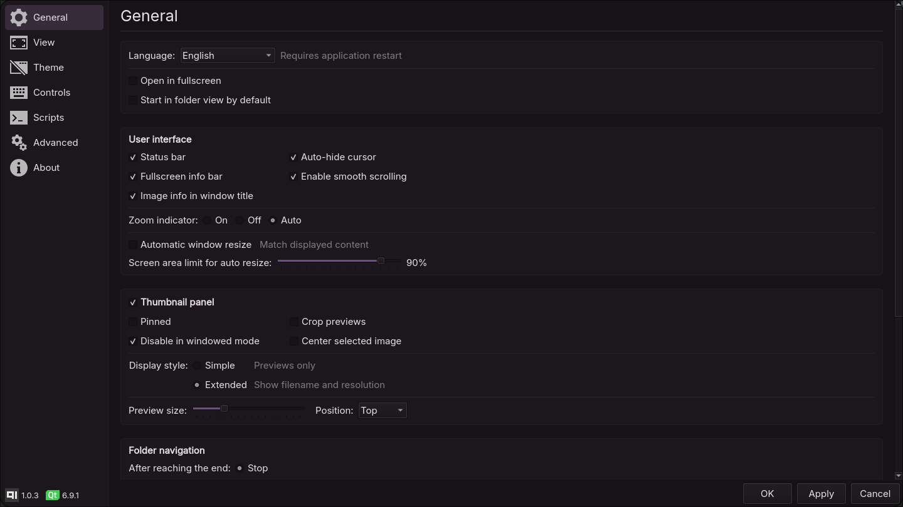

# Dotfiles

Arch Linux configuration with [Hyprland](https://hypr.land/), themed using [Matugen](https://github.com/InioX/matugen) to generate **Material You**-based colors from your wallpaper.

<br>

## 📝 TODO

- [ ] Fix SwayNC.

<br>

## 🖼️ Showcase

https://github.com/user-attachments/assets/67947a03-c216-45c9-9c7c-83a172e2590b

https://github.com/user-attachments/assets/7cd3b1b5-f198-4e73-9874-f730d4a72208

> [!NOTE]
> The images below demonstrate how the color palette adapts to different wallpapers. Colors are automatically generated by **Matugen** based on the current wallpaper.

> [!TIP]
> You can add any wallpaper to the **waypaper** menu by moving it to `~/Pictures/wallpapers/`.

### Desktop

<table>
    <tr>
        <th>Red</th>
        <th>Purple</th>
        <th>Pink</th>
    </tr>
    <tr>
        <td></td>
        <td></td>
        <td></td>
    </tr>
</table>

### GTK (Thunar)

<table>
    <tr>
        <th>Red</th>
        <th>Purple</th>
        <th>Pink</th>
    </tr>
    <tr>
        <td></td>
        <td></td>
        <td></td>
    </tr>
</table>

### QT (Qimgv)

<table>
    <tr>
        <th>Red</th>
        <th>Purple</th>
        <th>Pink</th>
    </tr>
    <tr>
        <td></td>
        <td></td>
        <td></td>
    </tr>
</table>

<br>

## 📦 Required depencencies

- `base-devel`
- `git`
- `yadm`

```bash
pacman -S --needed base-devel git yadm
```

<br>

## 📂 Getting the files

> [!CAUTION]
> This will **overwrite** any existing files with the same names in your directories.

Clone the repository with YADM:

```bash
yadm clone "https://github.com/DimitryGonzales/dotfiles.git"
```

<br>

## ⚙️ Installation

### Choose one of the following options:

#### Option 1: Dotfiles only

> [!NOTE]
> This script is still in development and is not included yet.

Run the `install.sh` script to install the required software:

```bash
~/Documents/scripts/installation/install.sh
```

#### Option 2: Full setup

Run the `setup.sh` script for a complete system setup including **display manager**, **window manager**, **apps**, **tools**, and more:

```bash
~/Documents/scripts/setup/setup.sh
```
