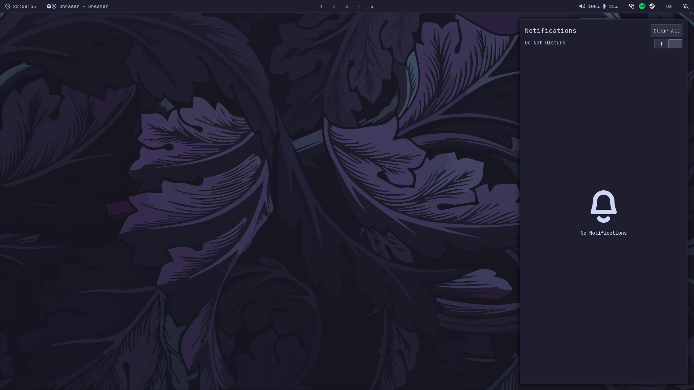
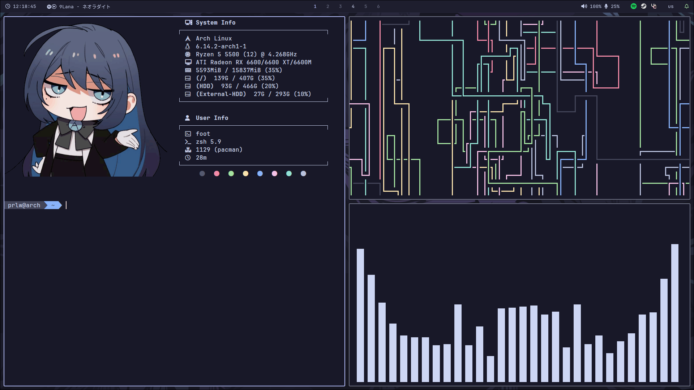
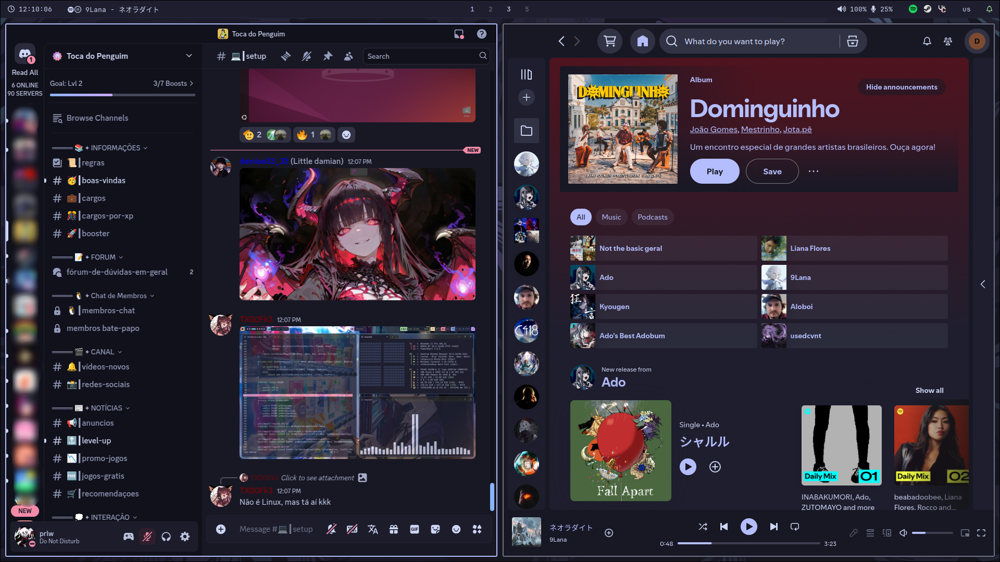
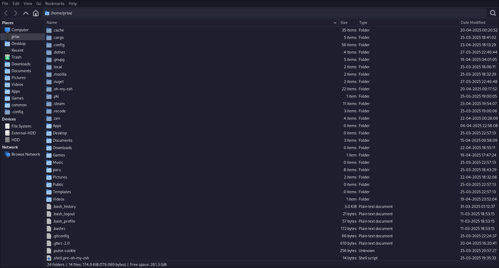
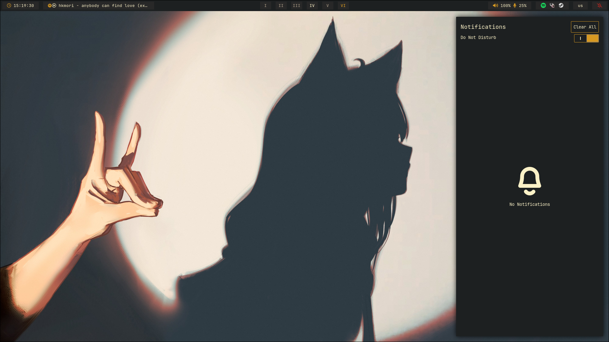
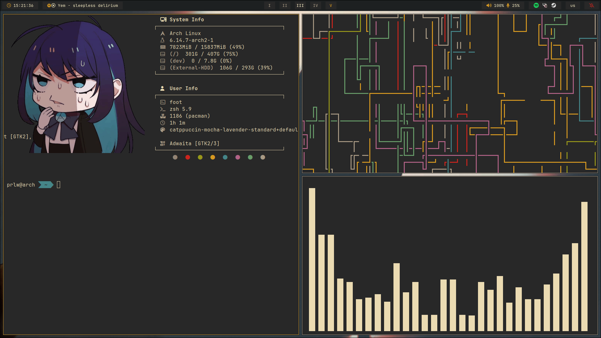
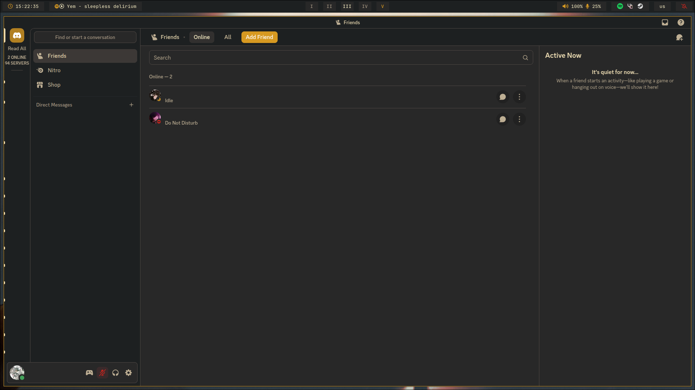
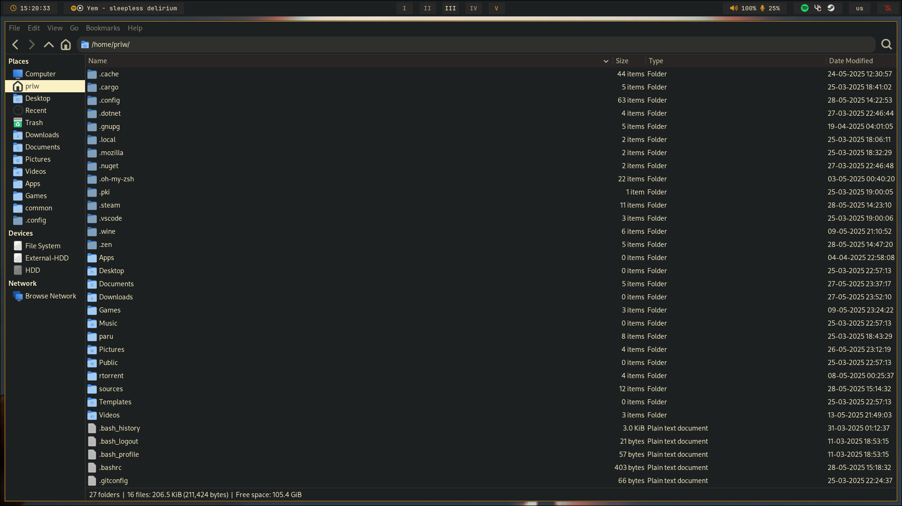

# 🎨 Dotfiles

My personal dotfiles for an Arch Linux installation.

## 📦 Required dependencies

- `git`
- `sudo`

```
sudo pacman -S git sudo
```

## 🛠️ Instructions

📌 **Clone this repository or download and copy its contents to your `home` directory:**

- **Option 1: Clone the repository**

```
cd ~
git clone "https://github.com/DimitryGonzales/dotfiles.git"
```

- **Option 2: Download and copy manually**

1. Download the repository.

2. Copy the files to your `home` directory:

```bash
cp -r path/to/files ~/
```

📌 **Run the `setup.sh` script to do an automated installation of my Linux setup.**

> ⚠️ Currently working on a separate version for the ones who just want the necessary packages.

📌 **Run the `theme.sh` script to apply or switch between themes.**

## VSCode

Install the matching color theme extension for your selected theme from the marketplace:

- [Catppuccin](https://marketplace.visualstudio.com/items?itemName=Catppuccin.catppuccin-vsc)

- [Gruvbox](https://marketplace.visualstudio.com/items?itemName=jdinhlife.gruvbox)

- [MacOS Modern Theme](https://marketplace.visualstudio.com/items?itemName=davidbwaters.macos-modern-theme)

## 🖼️ Examples

> ⚠️ *These images do not showcase all features/configurations.*

- Catppuccin Mocha Lavender

<table>
    <tr>
        <td></td>
        <td></td>
    </tr>
    <tr>
        <td></td>
        <td></td>
    </tr>
</table>

- Gruvbox Dark

<table>
    <tr>
        <td></td>
        <td></td>
    </tr>
    <tr>
        <td></td>
        <td></td>
    </tr>
</table>

- Minimalistic

<table>
    <tr>
        <td></td>
        <td></td>
    </tr>
    <tr>
        <td></td>
        <td></td>
    </tr>
</table>
