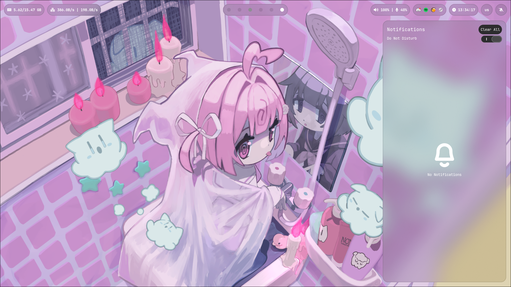
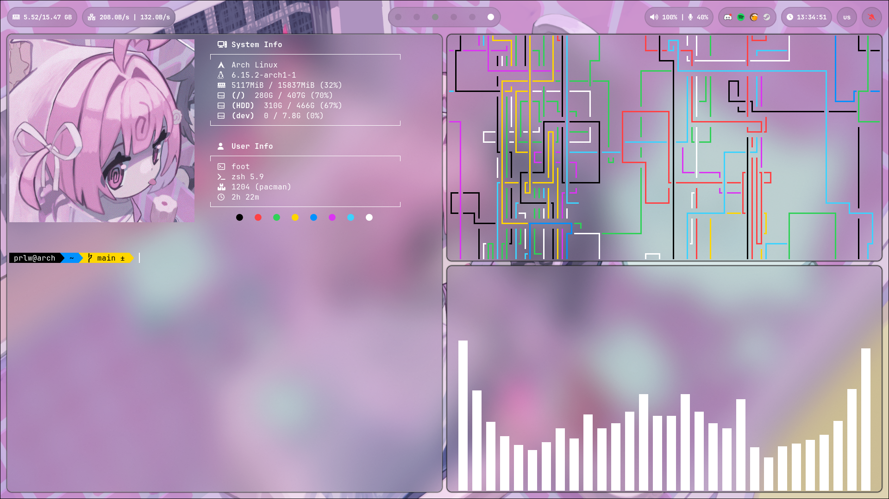
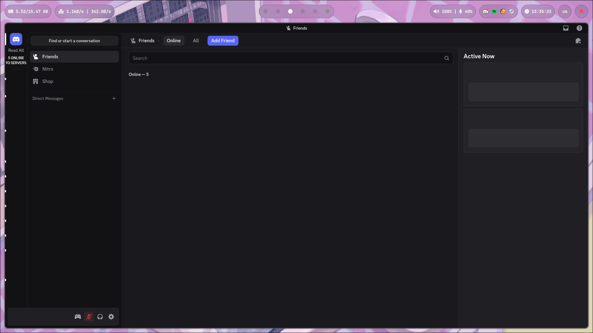
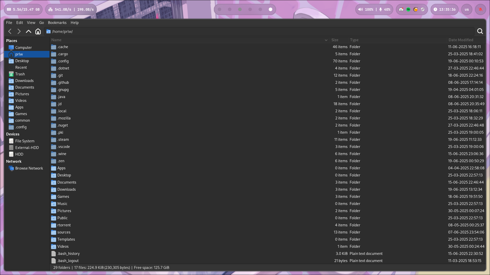
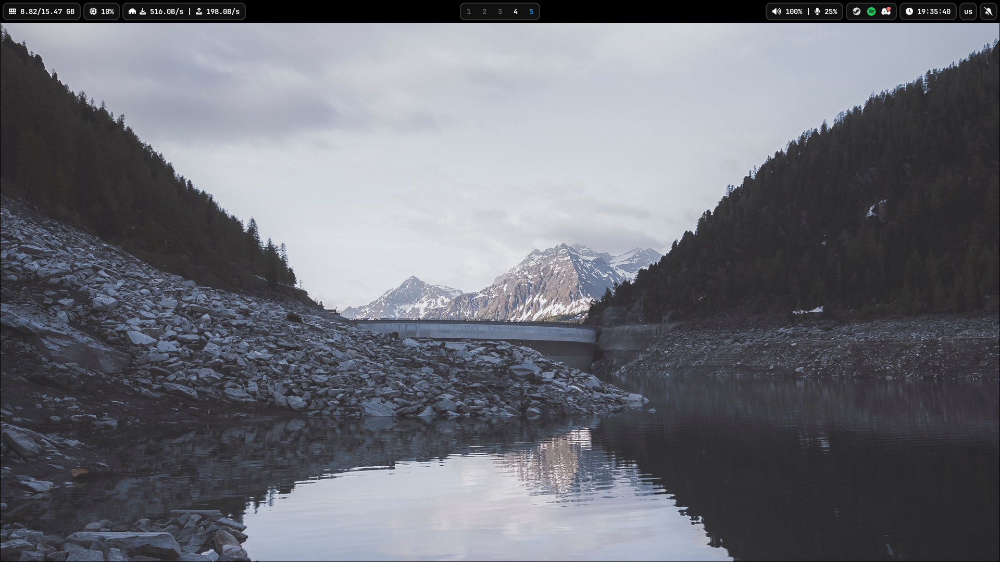
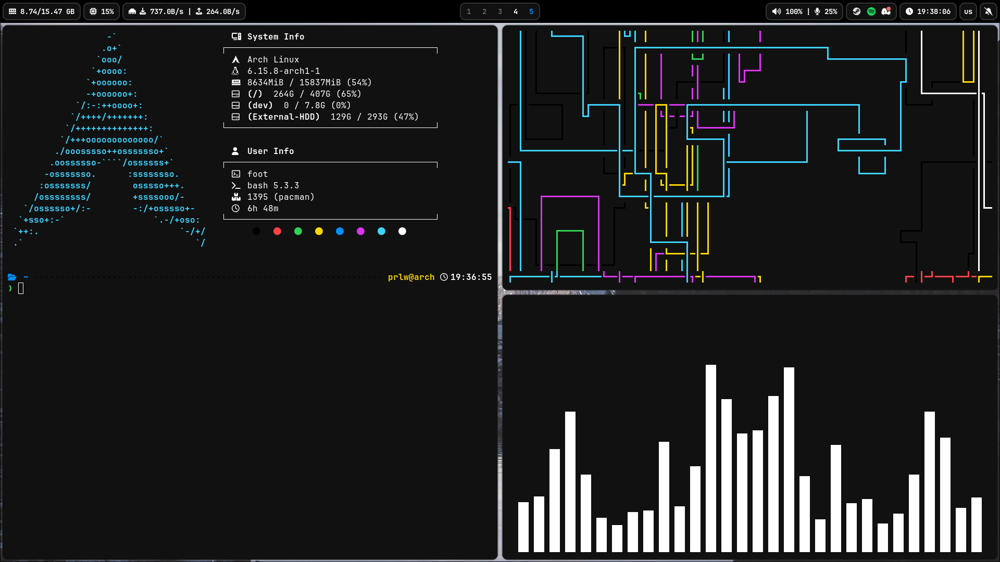
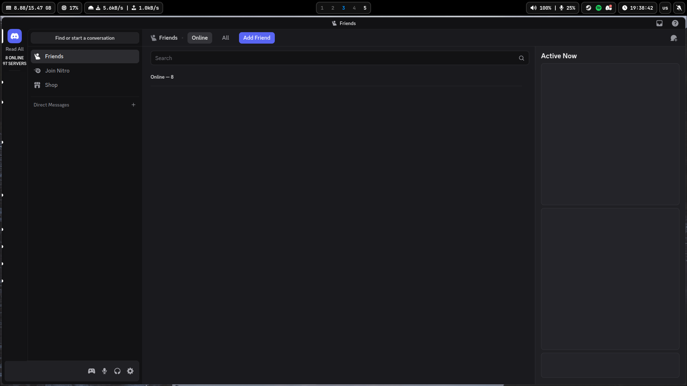
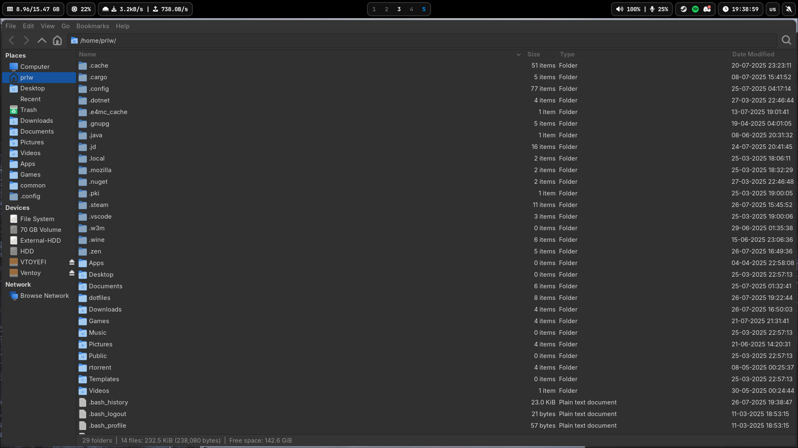

# Dotfiles

My personal dotfiles for an Arch Linux installation, including configurations for Hyprland, themes, and keybindings.

<br>

## 📝 TODO

- [ ] Make `install.sh` automatically copy the files to their respective directories.
- [ ] Update `theme.sh` structure.

<br>

## 📂 Cloning repository

**Clone this repository to your `home` folder:**

```bash
cd ~ && git clone "https://github.com/DimitryGonzales/dotfiles.git"
```

<br>

## 🤖 Automatic Installation

**Required dependencies:**

- `base-devel`
- `git`
- `sudo`

```bash
sudo pacman -S base-devel git sudo
```

**Run the `install.sh` script inside `installation` folder to do an automated installation of my Arch Linux setup:**

> [!WARNING]
> Backup your files. This will replace any files that have the same name inside the directories.

```bash
~/dotfiles/installation/install.sh
```

<br>

## ⚙️ Manual Installation

**Resources:**

> [!NOTE]
> I'm currently working on a complete list of all resources used in the project.

> [!TIP]
> In the meantime, you can do the [🤖 Automated Installation](#-automatic-installation) or explore the configuration files directly to see what’s included.

**Copy the necessary files to their respective directories**

> [!WARNING]
> Backup your files. This will replace any files that have the same name inside the directories.

```bash
cp -r ~/dotfiles/files/.config ~ && cp -r ~/dotfiles/files/.bashrc ~
```

<br>

## 🔔 Reminders

ℹ️ **Customize the files to suit your personal preferences (e.g., editing the Hyprland config file to adjust monitor settings).**

> [!TIP]
> After running git pull in the repository, remember to manually copy any new or updated files to avoid overwriting your custom changes.

<br>

## 🎨 Changing themes

**Run the `theme.sh` script inside `themes` folder to change the system theme.**

```bash
~/dotfiles/themes/theme.sh
```

<br>

## 🖼️ Examples

> [!NOTE]
> These screenshots do not showcase all features or configurations.

### 🧼 Blur

<table>
    <tr>
        <td></td>
        <td></td>
    </tr>
    <tr>
        <td></td>
        <td></td>
    </tr>
</table>

### 🌙 Catppuccin Mocha Lavender

<table>
    <tr>
        <td></td>
        <td></td>
    </tr>
    <tr>
        <td></td>
        <td></td>
    </tr>
</table>

### 🏔️ Dark

<table>
    <tr>
        <td></td>
        <td></td>
    </tr>
    <tr>
        <td></td>
        <td></td>
    </tr>
</table>

### 🟤 Gruvbox Dark

<table>
    <tr>
        <td></td>
        <td></td>
    </tr>
    <tr>
        <td></td>
        <td></td>
    </tr>
</table>
